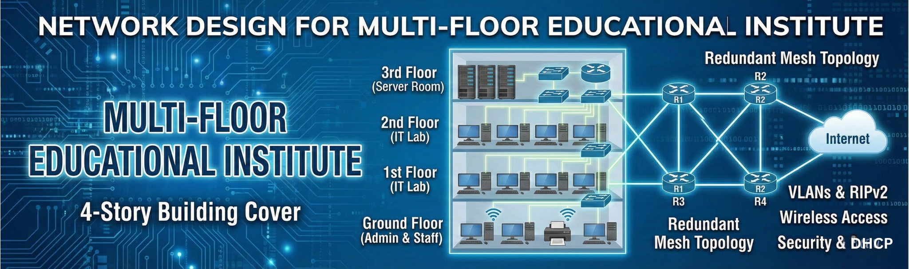

<!-- Repository Banner -->

  

---

## 🔹 Overview

The institute network spans **Ground Floor, 1st Floor, 2nd Floor, and 3rd Floor**, each using dedicated switches, PCs, and printers. All network segments interconnect via a **four-router topology (R1, R2, R3, R4)** located on the 3rd floor. The 3rd floor also hosts the **internet gateway** and server infrastructure.
>See the demo video below for a quick visual explanation of how the system works.

  

 
>Full system description referenced from project documentation.

---

## 🔹 Architecture

>### Architecture Summary

  

### Floor-by-Floor Network Layout

>### **Ground Floor**
Reference: Ground Floor Diagram
- 1 × 24/48-port switch  
- User PCs (4)  
- Printers (3)  
- Uplink to **R1** on the 3rd floor  
- Used for administrative or general-purpose access

>### **1st Floor**
Reference: 1st Floor Diagram 
- IT Lab environment  
- Contains ~20–25 PCs arranged in rows  
- Switch and router uplink section on the top-right of the lab  
- Lab traffic uplinks to **R1**

>### **2nd Floor**
Reference: 2nd Floor Diagram 
- Another IT Lab with PCs  
- Switch positioned to distribute traffic in multiple rows  
- Connects upward to **R2** using vertical riser cable

>### **3rd Floor**
Reference: 3rd Floor Diagram and Server Room
- Server Room with:  
  - 3 Servers  
  - 1 Switch  
  - Connection to Router Cluster  
- Staff Section (Teachers, Marketing/Admin, Managers) with PCs and printers  
- Switch + Router backbone connecting to **R3** and **R4**  
- Internet connection enters here

---

## 🔹 Logical Topology (Router Backbones)

>Routers:
- **R1** – handles Ground + 1st Floor traffic  
- **R2** – handles 2nd Floor  
- **R3, R4** – form backbone redundancy (connected to each other and to R1/R2)

>Routing:
- Uses **RIPv2**
- Supports:  
  - VLSM  
  - Multicast updates  
  - Triggered updates  
  - Discontinuous networks  
- Chosen because of a low number of routers and cost-effective design

---

## 🖧 Packet Tracer Design

Devices used (from presentation):

| Device Type | Quantity | Notes |
|-------------|----------|-------|
| Routers | 4 | Core inter-floor backbone |
| Switches | 4 | Includes 48-port & 8-port |
| Servers | 3 | Located on 3rd floor |
| Lab PCs | 50 | Two IT labs |
| Staff PCs | 35 | Teachers, Admin, Managers |
| Printers | 3 | Distributed on floors |

---

## 🔹 Security Measures

From presentation (Security section):

- Port security enabled on all switches  
- Unused ports disabled  
- Router & switch passwords protected via:  
  - Console password  
  - Enable password  
  - Encryption enabled  
- Antivirus installed on all user devices  
- DHCP assigns IPs to all floors  
- VLANs for separation (Teachers, Admin, IT Labs, etc.)

---

## 🔹 Maintenance & Test Plan

>Maintenance schedule:

- **Weekly:**  
  - Software updates  
  - Router, switch, and server health checks  
  - Documentation updates  
  - Security review  
- **Monthly:**  
  - Hardware inspection  
- **Testing:**  
  - Inter-VLAN pings  
  - Floor-to-floor connectivity checks  
  - DHCP address validation  
  - Redundancy path verification (R3-R4 link)

---

## 🔹 Inter-Floor Connectivity Verification

According to validation steps:
- Ping from Ground → 2nd Floor  
- Ping from 1st Floor → 3rd Floor (Server 2)  
- Ping across VLANs  
- Ping from 1st Floor → Printer on Ground  

All tests validated successful routing and VLAN communication.

---

## 📁 Files Included

- Ground Floor Layout (`Ground_Floor.pdf`)  
- First Floor Layout (`1 st floor.pdf`)  
- Second Floor Layout (`2 nd floor.pdf`)  
- Third Floor Layout (`3 rd floor.pdf`)  
- Main Topology Design (`Drawing3.jpeg`)  
- AIN Presentation (`AINtest1.pptx`)  

---

## 📌 Summary

This design provides:
- Redundancy using 4-router backbone  
- Segregation using VLANs  
- DHCP-based IP automation  
- Security hardening with port security and encrypted passwords  
- Scalable IT Lab configuration  
- Centralized server infrastructure on the 3rd floor  

The network is optimized for **education environments**, offering reliability, cost-efficiency, and scalability for future expansion.

---

## 🔹 Credits

Group Members:
- Perera H.A.K.D  
- Jayasekera P.Y.R  
- Kasthuriarachchi S.D  
- Liyanage R.S.H
